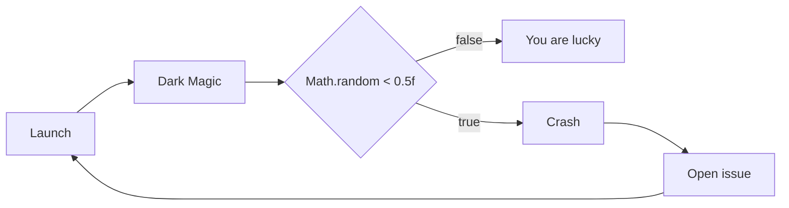

# S.A.U.W.

S.A.U.W. is a LibGDX Android game

___

___

## How S.A.U.W. works

## Modding docs

[RU](https://github.com/KirboGames/S.A.U.W.-/wiki/Home-ru)

## Contributing

If you want to add content or update textures look [CONTRIBUTING.md](docs/CONTRIBUTING.md)

## Credits

* Programming - by [KiRB0](https://github.com/KirboGames)
* Artwork - by [KiRB0](https://github.com/KirboGames) & Ertzui44
* Music - by [KiRB0](https://t.me/KiRB0_official)
